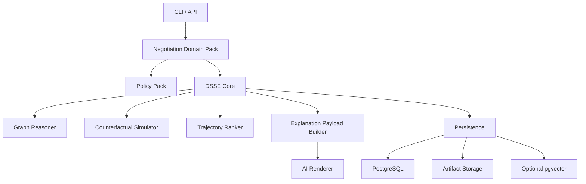
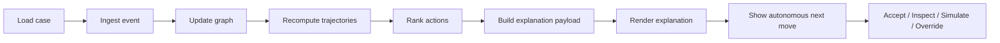
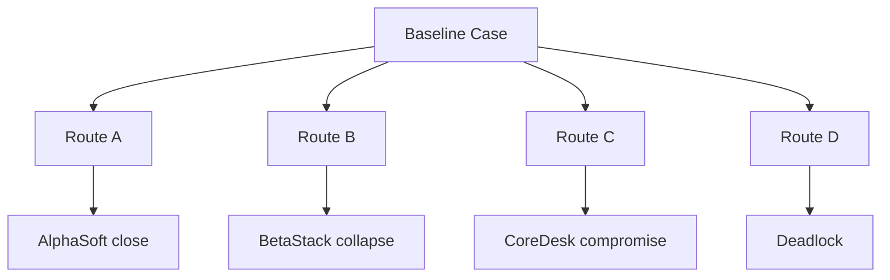

# Decision State Space Engine (DSSE)

**Negotiation-facing tagline**  
A probabilistic decision state-space explorer for negotiation that explores possible deal futures, ranks viable paths, and recommends the strongest next move.

DSSE is a domain-neutral engine. The first flagship domain pack is **Negotiation**.

## Why this exists

Negotiations are not linear scripts. They are branching decision spaces with:

- multiple actors
- conflicting constraints
- incomplete evidence
- competing trajectories
- uncertain outcomes

DSSE models that space, scores trajectories, and simulates what the autonomous system would do next.

## Core principles

- **Domain-neutral core**: DSSE uses neutral terms like case, actor, action, trajectory, and outcome.
- **Negotiation as a pack**: providers, proposals, and close paths live in the negotiation domain pack.
- **PostgreSQL for operational truth**: structured state lives in PostgreSQL.
- **Raw artifacts stay raw**: PDFs, emails, and transcripts live on disk or object storage and are referenced by the database.
- **Interactive CLI**: the CLI shows business context, metrics, evidence, and the autonomous next move.
- **No route required for live cases**: routes are for tutorial, QA, replay, and compare.

## Architecture



## Runtime loop



## Route matrix



## Installation

### 1. Install PGVECTOR library for PostgreSQL
```bash
chmod +x ./install-pgvector.sh
bash install-pgvector.sh
```

### 2. Create a virtual environment & install dependencies

```bash
python -m venv .venv
source .venv/bin/activate
pip install -e .
```

### 3. Run interactive setup

```bash
dsse setup
```

The setup wizard will:

- ask which AI model you want
- optionally download it from Hugging Face
- ask for a PostgreSQL connection string
- check schema readiness
- optionally enable `pgvector`
- optionally expose the bundled sample case

## Database requirements

- PostgreSQL 15+
- `pgvector` optional

## Important commands

### Interactive setup

```bash
dsse setup
```

### Reset database and local state

```bash
dsse reset
```

### Clear only local state

```bash
dsse reset --local-only
```

### List cases

```bash
dsse case list
```

### Start a live case

```bash
dsse case start strategic-multi-lane-deadlock
```

### Run a live case interactively

```bash
dsse case run strategic-multi-lane-deadlock
```

### Run tutorial mode on a known route

```bash
dsse tutorial run strategic-multi-lane-deadlock --route alpha_close
```

## Interactive CLI flow

Every cycle follows this order:

1. Ran command
2. Business case
3. Negotiation baseline
4. Current ranking before new event
5. New event
6. Detected changes
7. Metric update
8. Current ranking after new event
9. Agent decision
10. Why this action wins
11. Next

## Sample case files

The negotiation tutorial case is stored under:

```text
data/cases/strategic-multi-lane-deadlock/
```

The CLI prints exact file paths for:

- case definition
- baseline files
- proposal artifacts
- supporting emails
- event artifacts

## What this codebase includes

- DSSE core with domain-neutral terms
- negotiation pack mappings and scoring
- SDT-ready PostgreSQL schema
- interactive Typer CLI
- networkx graph reasoning
- route matrix support
- sample nightmare case
- reset command with safe database clear semantics and local-only option

## Notes on production readiness

This codebase is designed as a strong, professional starter. It includes:

- deterministic explanation payloads
- AI rendering hooks
- PostgreSQL schema management
- explicit lifecycle stages
- route orchestration

You should still validate the actual database, model download, and environment integration in your deployment environment before calling it production-complete.
